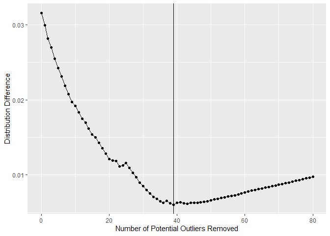
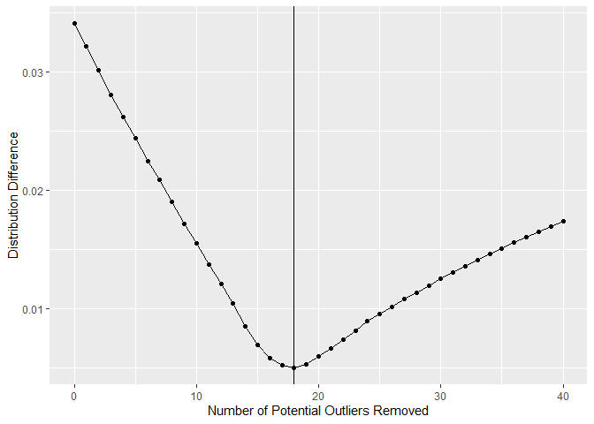
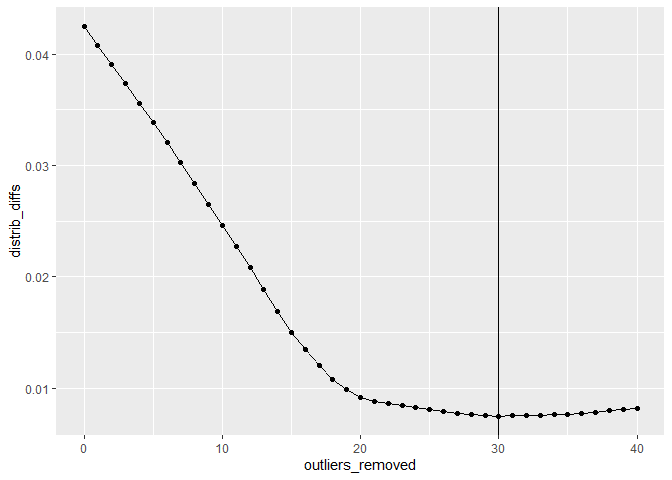
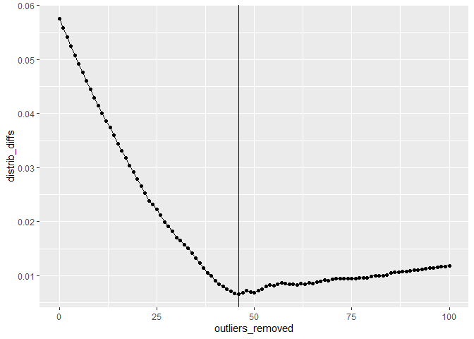
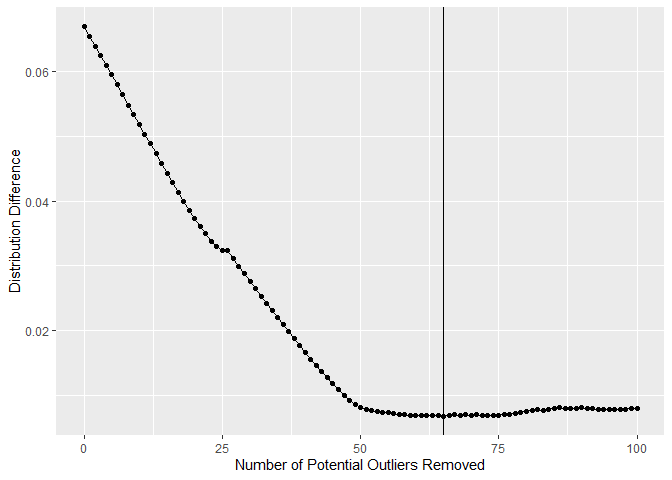
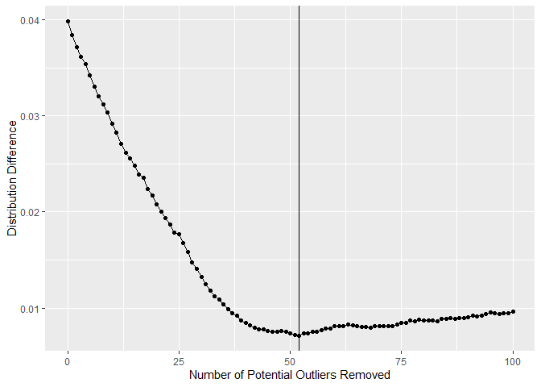
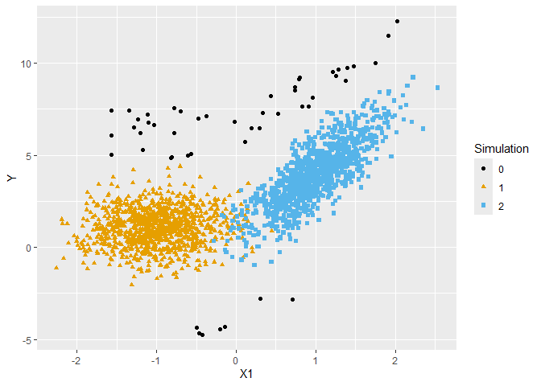
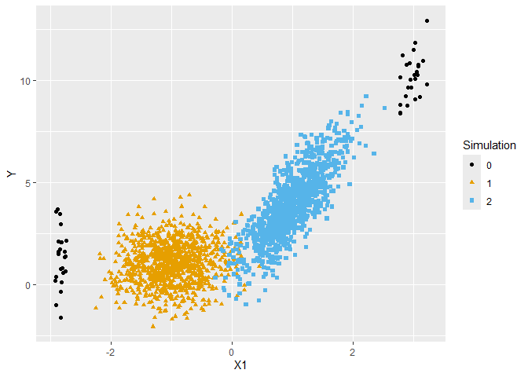
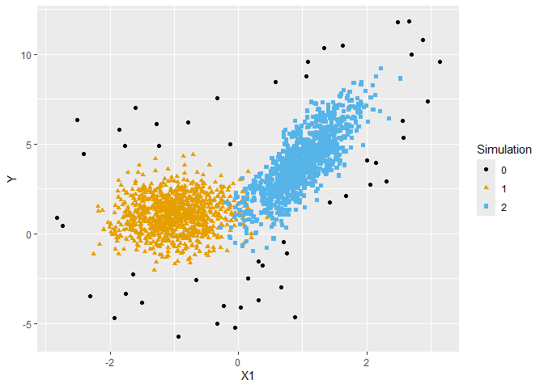
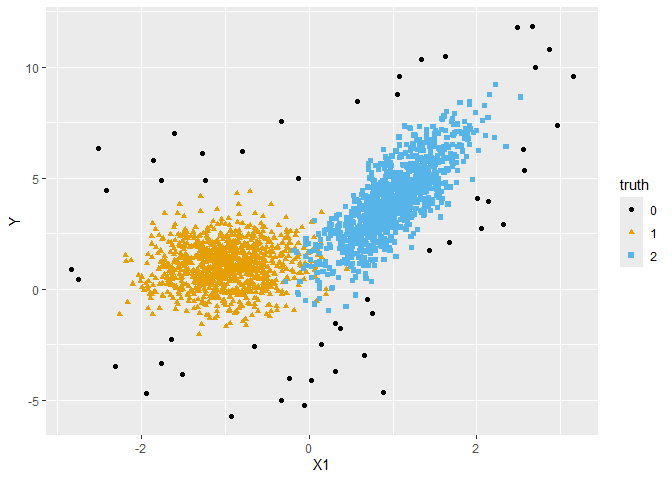

outlierMBC
================
Ultán P. Doherty
2024-06-26

# Outlier Identification for Model-Based Clustering

- `ombc_gmm` - Identify multivariate outliers while clustering data with
  a Gaussian mixture model.
- `ombc_lcwm` - Identify covariate and/or response outliers while
  fitting a linear cluster-weighted model to the data.
- `simulate_gmm` - Simulate data from a Gaussian mixture model with
  multivariate outliers.
- `simulate_lcwm` - Simulate data from a linear cluster-weighted model
  with covariate and/or response outliers.

``` r
library(ggplot2)
devtools::load_all()
```

## Mixture Models

``` r
n_vec <- c(2000, 1000, 1000)
mu_list <- list(c(-1, 0), c(+1, -1), c(+1, +1))
sigma_list <- list(
  diag(c(0.2, 4 * 0.2)),
  diag(c(0.2, 0.2)),
  diag(c(0.2, 0.2))
)

gmm_p2g3 <- simulate_gmm(
  n_vec, mu_list, sigma_list,
  outlier_num = 40, seed = 123, crit_val = 0.9999,
  unif_range_multiplier = 1.5
)
```

``` r
ggplot(
  as.data.frame(gmm_p2g3),
  aes(
    x = V1, y = V2,
    colour = as.factor(labels), shape = as.factor(labels)
  )
) +
  geom_point() +
  labs(colour = "truth", shape = "truth") +
  ggokabeito::scale_colour_okabe_ito(order = c(9, 1, 2, 3))
```

<!-- -->

``` r
ombc_gmm_p2g3 <- ombc_gmm(gmm_p2g3[, 1:2],
  comp_num = 3, max_out = 80,
  print_interval = Inf
)
```

``` r
ggplot(
  data.frame(
    outliers_removed = 0:80,
    distrib_diffs = ombc_gmm_p2g3$distrib_diffs
  ),
  aes(x = outliers_removed, y = distrib_diffs)
) +
  geom_line() +
  geom_point() +
  geom_vline(xintercept = ombc_gmm_p2g3$outlier_num)
```

<!-- -->

``` r
ggplot(
  as.data.frame(gmm_p2g3),
  aes(
    x = V1, y = V2,
    colour = as.factor(ombc_gmm_p2g3$gmm_labels),
    shape = as.factor(1 + labels)
  )
) +
  geom_point() +
  labs(colour = "ombc_gmm", shape = "truth") +
  ggokabeito::scale_colour_okabe_ito(order = c(9, 1, 2, 3))
```

<!-- -->

## Linear Cluster-Weighted Models

### Single Component, Response Outliers

``` r
lcwm_p1g1_y_only <- simulate_lcwm(
  n = 1000,
  mu = list(c(1)),
  sigma = list(as.matrix(0.1)),
  beta = list(c(1, 1)),
  error_sd = 0.5,
  outlier_num = 20,
  outlier_type = "y_only",
  seed = 123,
  crit_val = 0.9999
)
```

``` r
lcwm_p1g1_y_only |>
  ggplot(aes(x = X1, y = Y, colour = as.factor(G), shape = as.factor(G))) +
  geom_point() +
  labs(colour = "truth", shape = "truth") +
  ggokabeito::scale_colour_okabe_ito(order = c(9, 1))
```

<!-- -->

``` r
ombc_lcwm_p1g1_y_only <- ombc_lcwm(
  xy = lcwm_p1g1_y_only,
  x = lcwm_p1g1_y_only$X1,
  y_formula = Y ~ X1,
  comp_num = 1,
  max_out = 40,
  mnames = "V",
  seed = 123,
  outlier_type = "y_only"
)
```

    ## 
    ## Estimating model with k=1, Xnorm=V, familyY=gaussian *
    ## 
    ## Estimated model with k = 1 group(s) and parsimonious model V and family gaussian(identity)

``` r
ggplot(
  data.frame(
    outliers_removed = 0:40,
    distrib_diffs = ombc_lcwm_p1g1_y_only$distrib_diffs,
    outlier_num = ombc_lcwm_p1g1_y_only$outlier_num
  ),
  aes(x = outliers_removed, y = distrib_diffs)
) +
  geom_line() +
  geom_point() +
  geom_vline(aes(xintercept = outlier_num))
```

<!-- -->

``` r
lcwm_p1g1_y_only |>
ggplot(aes(
  x = X1, y = Y,
  colour = as.factor(ombc_lcwm_p1g1_y_only$outlier_bool),
  shape = as.factor(G)
  )
) +
  geom_point() +
  labs(colour = "outlierMBC", shape = "truth") +
  ggokabeito::scale_colour_okabe_ito(order = c(9, 1, 2, 3))
```

<!-- -->

### Single Component, Covariate Outliers

``` r
lcwm_p1g1_x_only <- simulate_lcwm(
  n = 1000,
  mu = list(c(1)),
  sigma = list(as.matrix(0.1)),
  beta = list(c(1, 1)),
  error_sd = 0.5,
  outlier_num = 20,
  outlier_type = "x_only",
  seed = 123,
  crit_val = 0.9999
)
```

``` r
lcwm_p1g1_x_only |>
  ggplot(aes(x = X1, y = Y, colour = as.factor(G), shape = as.factor(G))) +
  geom_point() +
  labs(colour = "truth", shape = "truth") +
  ggokabeito::scale_colour_okabe_ito(order = c(9, 1))
```

<!-- -->

``` r
ombc_lcwm_p1g1_x_only <- ombc_lcwm(
  xy = lcwm_p1g1_x_only,
  x = lcwm_p1g1_x_only$X1,
  y_formula = Y ~ X1,
  comp_num = 1,
  max_out = 40,
  mnames = "V",
  seed = 123,
  outlier_type = "x_only"
)
```

    ## 
    ## Estimating model with k=1, Xnorm=V, familyY=gaussian *
    ## 
    ## Estimated model with k = 1 group(s) and parsimonious model V and family gaussian(identity)

``` r
ggplot(
  data.frame(
    outliers_removed = 0:40,
    distrib_diffs = ombc_lcwm_p1g1_x_only$distrib_diffs,
    outlier_num = ombc_lcwm_p1g1_x_only$outlier_num
  ),
  aes(x = outliers_removed, y = distrib_diffs)
) +
  geom_line() +
  geom_point() +
  geom_vline(aes(xintercept = outlier_num))
```

<!-- -->

``` r
lcwm_p1g1_x_only |>
ggplot(aes(
  x = X1, y = Y,
  colour = as.factor(ombc_lcwm_p1g1_x_only$outlier_bool),
  shape = as.factor(G)
  )
) +
  geom_point() +
  labs(colour = "outlierMBC", shape = "truth") +
  ggokabeito::scale_colour_okabe_ito(order = c(9, 1, 2, 3))
```

<!-- -->

### Single Component, Combined Outliers

``` r
lcwm_p1g1_x_and_y <- simulate_lcwm(
  n = 1000,
  mu = list(c(1)),
  sigma = list(as.matrix(0.1)),
  beta = list(c(1, 1)),
  error_sd = 0.5,
  outlier_num = 20,
  outlier_type = "x_and_y",
  seed = 123,
  crit_val = 0.9999
)
```

``` r
lcwm_p1g1_x_and_y |>
  ggplot(aes(x = X1, y = Y, colour = as.factor(G), shape = as.factor(G))) +
  geom_point() +
  labs(colour = "truth", shape = "truth") +
  ggokabeito::scale_colour_okabe_ito(order = c(9, 1))
```

<!-- -->

``` r
ombc_lcwm_p1g1_x_and_y <- ombc_lcwm(
  xy = lcwm_p1g1_x_and_y,
  x = lcwm_p1g1_x_and_y$X1,
  y_formula = Y ~ X1,
  comp_num = 1,
  max_out = 40,
  mnames = "V",
  seed = 123,
  outlier_type = "x_and_y"
)
```

    ## 
    ## Estimating model with k=1, Xnorm=V, familyY=gaussian *
    ## 
    ## Estimated model with k = 1 group(s) and parsimonious model V and family gaussian(identity)

``` r
ggplot(
  data.frame(
    outliers_removed = 0:40,
    distrib_diffs = ombc_lcwm_p1g1_x_and_y$distrib_diffs,
    outlier_num = ombc_lcwm_p1g1_x_and_y$outlier_num
  ),
  aes(x = outliers_removed, y = distrib_diffs)
) +
  geom_line() +
  geom_point() +
  geom_vline(aes(xintercept = outlier_num))
```

<!-- -->

``` r
lcwm_p1g1_x_and_y |>
ggplot(aes(
  x = X1, y = Y,
  colour = as.factor(ombc_lcwm_p1g1_x_and_y$outlier_bool),
  shape = as.factor(G)
  )
) +
  geom_point() +
  labs(colour = "outlierMBC", shape = "truth") +
  ggokabeito::scale_colour_okabe_ito(order = c(9, 1, 2, 3))
```

<!-- -->

### Two-Component, Response Outliers

``` r
lcwm_p1g2_y_only <- simulate_lcwm(
  n = c(1000, 1000),
  mu = list(c(-1), c(+1)),
  sigma = list(as.matrix(0.2), as.matrix(0.2)),
  beta = list(c(1, 0), c(1, 3)),
  error_sd = c(1, 1),
  outlier_num = c(25, 25),
  outlier_type = "y_only",
  seed = 123,
  crit_val = 0.9999,
  range_multipliers = c(1.5, 2)
)
```

``` r
lcwm_p1g2_y_only |>
  ggplot(aes(x = X1, y = Y, colour = as.factor(G), shape = as.factor(G))) +
  geom_point() +
  labs(colour = "truth", shape = "truth") +
  ggokabeito::scale_colour_okabe_ito(order = c(9, 1, 2))
```

<!-- -->

``` r
ombc_lcwm_p1g2_y_only <- ombc_lcwm(
  xy = lcwm_p1g2_y_only,
  x = lcwm_p1g2_y_only$X1,
  y_formula = Y ~ X1,
  comp_num = 2,
  max_out = 100,
  mnames = "V",
  seed = 123,
  outlier_type = "y_only"
)
```

    ## 
    ## Estimating model with k=2, Xnorm=V, familyY=gaussian *****************
    ## 
    ## Estimated model with k = 2 group(s) and parsimonious model V and family gaussian(identity)

``` r
ggplot(
  data.frame(
    outliers_removed = 0:100,
    distrib_diffs = ombc_lcwm_p1g2_y_only$distrib_diffs,
    outlier_num = ombc_lcwm_p1g2_y_only$outlier_num
  ),
  aes(x = outliers_removed, y = distrib_diffs)
) +
  geom_line() +
  geom_point() +
  geom_vline(aes(xintercept = outlier_num))
```

<!-- -->

``` r
lcwm_p1g2_y_only |>
ggplot(aes(
  x = X1, y = Y,
  colour = as.factor(ombc_lcwm_p1g2_y_only$outlier_bool),
  shape = as.factor(G)
  )
) +
  geom_point() +
  labs(colour = "outlierMBC", shape = "truth") +
  ggokabeito::scale_colour_okabe_ito(order = c(9, 1, 2, 3))
```

<!-- -->

### Two-Component, Covariate Outliers

``` r
lcwm_p1g2_x_only <- simulate_lcwm(
  n = c(1000, 1000),
  mu = list(c(-1), c(+1)),
  sigma = list(as.matrix(0.2), as.matrix(0.2)),
  beta = list(c(1, 0), c(1, 3)),
  error_sd = c(1, 1),
  outlier_num = c(25, 25),
  outlier_type = "x_only",
  seed = 123,
  crit_val = 0.9999,
  range_multipliers = c(1.5, 2)
)
```

``` r
lcwm_p1g2_x_only |>
  ggplot(aes(x = X1, y = Y, colour = as.factor(G), shape = as.factor(G))) +
  geom_point() +
  labs(colour = "truth", shape = "truth") +
  ggokabeito::scale_colour_okabe_ito(order = c(9, 1, 2))
```

<!-- -->

``` r
ombc_lcwm_p1g2_x_only <- ombc_lcwm(
  xy = lcwm_p1g2_x_only,
  x = lcwm_p1g2_x_only$X1,
  y_formula = Y ~ X1,
  comp_num = 2,
  max_out = 100,
  mnames = "V",
  seed = 123,
  outlier_type = "x_only"
)
```

    ## 
    ## Estimating model with k=2, Xnorm=V, familyY=gaussian ******************
    ## 
    ## Estimated model with k = 2 group(s) and parsimonious model V and family gaussian(identity)

``` r
ggplot(
  data.frame(
    outliers_removed = 0:100,
    distrib_diffs = ombc_lcwm_p1g2_x_only$distrib_diffs,
    outlier_num = ombc_lcwm_p1g2_x_only$outlier_num
  ),
  aes(x = outliers_removed, y = distrib_diffs)
) +
  geom_line() +
  geom_point() +
  geom_vline(aes(xintercept = outlier_num))
```

<!-- -->

``` r
lcwm_p1g2_x_only |>
ggplot(aes(
  x = X1, y = Y,
  colour = as.factor(ombc_lcwm_p1g2_x_only$outlier_bool),
  shape = as.factor(G)
  )
) +
  geom_point() +
  labs(colour = "outlierMBC", shape = "truth") +
  ggokabeito::scale_colour_okabe_ito(order = c(9, 1, 2, 3))
```

<!-- -->

### Two-Component, Combined Outliers

``` r
lcwm_p1g2_x_and_y <- simulate_lcwm(
  n = c(1000, 1000),
  mu = list(c(-1), c(+1)),
  sigma = list(as.matrix(0.2), as.matrix(0.2)),
  beta = list(c(1, 0), c(1, 3)),
  error_sd = c(1, 1),
  outlier_num = c(25, 25),
  outlier_type = "x_and_y",
  seed = 123,
  crit_val = 0.9999,
  range_multipliers = c(1.5, 2)
)
```

``` r
lcwm_p1g2_x_and_y |>
  ggplot(aes(x = X1, y = Y, colour = as.factor(G), shape = as.factor(G))) +
  geom_point() +
  labs(colour = "truth", shape = "truth") +
  ggokabeito::scale_colour_okabe_ito(order = c(9, 1, 2))
```

<!-- -->

``` r
ombc_lcwm_p1g2_x_and_y <- ombc_lcwm(
  xy = lcwm_p1g2_x_and_y,
  x = lcwm_p1g2_x_and_y$X1,
  y_formula = Y ~ X1,
  comp_num = 2,
  max_out = 100,
  mnames = "V",
  seed = 123,
  outlier_type = "x_and_y"
)
```

    ## 
    ## Estimating model with k=2, Xnorm=V, familyY=gaussian *****************
    ## 
    ## Estimated model with k = 2 group(s) and parsimonious model V and family gaussian(identity)

``` r
ggplot(
  data.frame(
    outliers_removed = 0:100,
    distrib_diffs = ombc_lcwm_p1g2_x_and_y$distrib_diffs,
    outlier_num = ombc_lcwm_p1g2_x_and_y$outlier_num
  ),
  aes(x = outliers_removed, y = distrib_diffs)
) +
  geom_line() +
  geom_point() +
  geom_vline(aes(xintercept = outlier_num))
```

<!-- -->

``` r
lcwm_p1g2_x_and_y |>
ggplot(aes(
  x = X1, y = Y,
  colour = as.factor(ombc_lcwm_p1g2_x_and_y$outlier_bool),
  shape = as.factor(G)
  )
) +
  geom_point() +
  labs(colour = "outlierMBC", shape = "truth") +
  ggokabeito::scale_colour_okabe_ito(order = c(9, 1, 2, 3))
```

<!-- -->
