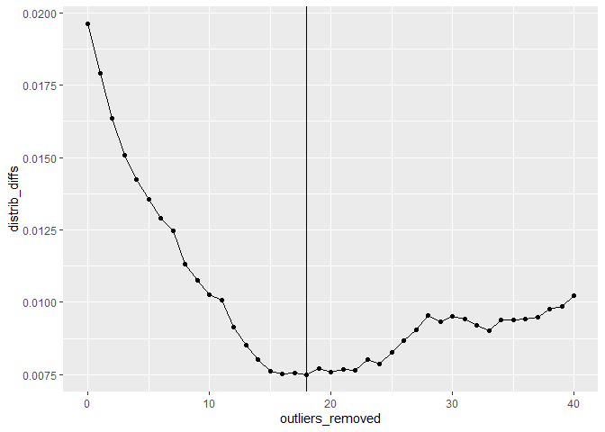

idioClust
================
Ultán P. Doherty
2024-04-18

## Iterative Detection & Identification of Outliers while Clustering

- `idio_gmm` - Identify multivariate outliers while clustering the data
  with a Gaussian mixture model.
- `idio_mlr` - Identify response variable outliers while fitting a
  multiple linear regression model to the data.
- `simulate_noisy_gmm` - Simulate data from a Gaussian mixture model
  with multivariate outliers.
- `simulate_noisy_mlr` - Simulate data from a multiple linear regression
  model with response variable outliers.

``` r
library(ggplot2)
devtools::load_all()
```

    ## ℹ Loading idioClust

### `simulate_noisy_gmm`

``` r
n_vec <- c(2000, 1000, 1000)
mu_list <- list(c(-1, 0), c(+1, -1), c(+1, +1))
sigma_list <- list(diag(c(0.2, 4 * 0.2)),
                  diag(c(0.2, 0.2)),
                  diag(c(0.2, 0.2)))

noisy_gmm_p2g3 <- simulate_noisy_gmm(
 n_vec, mu_list, sigma_list,
 outlier_num = 40, seed = 123, crit_val = 0.9999,
 unif_range_multiplier = 1.5
)
```

``` r
ggplot(as.data.frame(noisy_gmm_p2g3),
       aes(x = V1, y = V2,
           colour = as.factor(labels), shape = as.factor(labels))) +
  geom_point() +
  labs(colour = "truth", shape = "truth") +
  ggokabeito::scale_colour_okabe_ito(order = c(9, 1, 2, 3))
```

<!-- -->

### `idio_gmm`

``` r
idio_gmm_p2g3 <- idio_gmm(noisy_gmm_p2g3[, 1:2], comp_num = 3, max_out = 100,
                         print_interval = Inf)
```

``` r
ggplot(cbind(outliers_removed = 0:100, as.data.frame(idio_gmm_p2g3)),
       aes(x = outliers_removed, y = distrib_diffs)) +
  geom_line() +
  geom_point() +
  geom_vline(aes(xintercept = outlier_num))
```

<!-- -->

``` r
ggplot(as.data.frame(noisy_gmm_p2g3),
       aes(x = V1, y = V2,
           colour = as.factor(idio_gmm_p2g3$gmm_labels),
           shape = as.factor(1 + labels))) +
  geom_point() +
  labs(colour = "idio_gmm", shape = "truth") +
  ggokabeito::scale_colour_okabe_ito(order = c(9, 1, 2, 3))
```

<!-- -->

### `simulate_noisy_mlr`

``` r
n_vec <- c(1000)
mu_list <- list(+1)
sigma_list <- list(as.matrix(0.1))
beta_list <- list(c(1, 1))
error_sd_vec <- c(0.1)

noisy_mlr_p1 <- simulate_noisy_mlr(n_vec, mu_list, sigma_list, beta_list,
                                   error_sd_vec,
                                   outlier_num = 20, seed = 123,
                                   crit_val = 0.9999)
```

``` r
ggplot(as.data.frame(noisy_mlr_p1),
       aes(x = V1, y = responses,
           colour = as.factor(labels), shape = as.factor(labels))) +
  geom_point() +
  labs(colour = "truth", shape = "truth") +
  ggokabeito::scale_colour_okabe_ito(order = c(9, 1))
```

<!-- -->

### `idio_mlr`

``` r
idio_mlr_p1 <- idio_mlr(noisy_mlr_p1$covariates, noisy_mlr_p1$responses,
                        max_out = 50, print_interval = Inf)
```

``` r
ggplot(data.frame(outliers_removed = 0:50,
                  distrib_diffs = idio_mlr_p1$distrib_diffs,
                  outlier_num = idio_mlr_p1$outlier_num),
       aes(x = outliers_removed, y = distrib_diffs)) +
  geom_line() +
  geom_point() +
  geom_vline(aes(xintercept = outlier_num))
```

<!-- -->

``` r
ggplot(as.data.frame(noisy_mlr_p1),
       aes(x = V1, y = responses,
           colour = as.factor(1 + idio_mlr_p1$outlier_bool),
           shape = as.factor(1 + labels))) +
  geom_point() +
  labs(colour = "idio_mlr", shape = "truth") +
  ggokabeito::scale_colour_okabe_ito(order = c(9, 1, 2, 3))
```

<!-- -->
